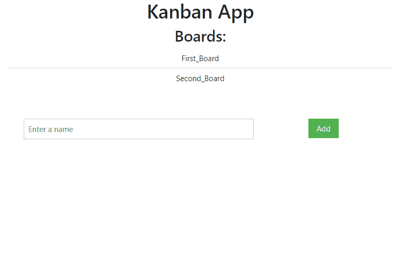

# Integration_backend_frontend

L'intégralité du tp se trouve sur la branche par défaut `main`.

Pour lancer, un simple `npm start`à la racine du projet après avoir installé les dépendances via `npm install` permet de voir l'application en mode dev.

Cette application dépend du back-end que vous trouverez à l'adresse suivante : https://github.com/NilsRichard/Master2_KanbanApp

**Il est nécessaire que le back-end tourne pour que le front-end puisse fonctionner correctement.**

## Auteurs

- Dorian Bouillet
- Nils Richard

*Démo rapide :*

